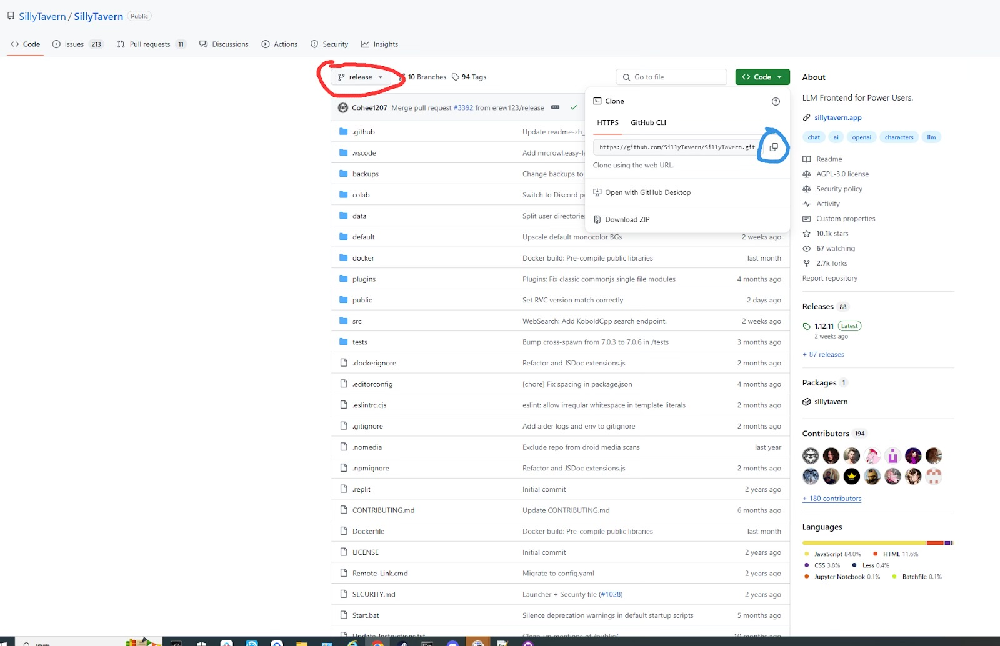
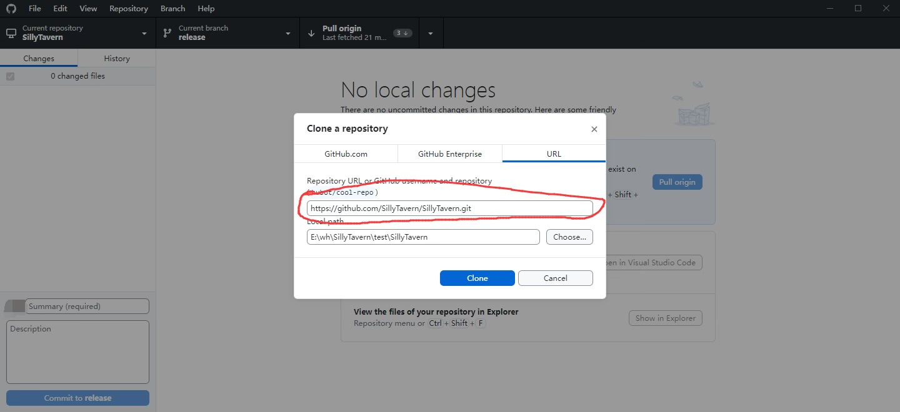

# 通过 Github Desktop 在PC本地安装酒馆/Clewd/YouChat_Proxy

!!! note "作者：Re_ki（类脑dc@belldd.）"

	作者不对您在参考本教程时因误操作或其他原因造成的任何时间及其他损失负责。

通过Github Desktop安装酒馆或其他任何Github项目（包括clewd, You_proxy等等）是本人认为最简单最方便的方式，在此之间，你需要通过这里的[教程](silly.md)来安装 git 和 npm，那接下来终于到了最后一步。

在其他的教程中，通过cmd命令行来安装酒馆或其他相关Github项目虽然是一种方法，但是命令行的缺点也显而易见，比如：对新手不友好，必须手动输入命令，手滑了容易寄，无法简单的分辨当前的branch和版本，无法方便快速的在多个不同的项目之间进行切换管理。所以在这里，我必须推荐一个超级方便的官方项目管理工具： Github Desktop！

那么，GD的好处都有啥？它有着简单易懂的UI界面，**一目了然的项目管理，方便快捷的一键更新与branch切换。不需要输入任何命令行，easy!**

## 使用方法：

- 在[官网](https://desktop.github.com/download/)下载并安装Github desktop。不论是Mac还是Windows都可以使用。
	- 程序启动后，前往[酒馆官方github页面](https://github.com/SillyTavern/SillyTavern)，确保红圈内是”release”，并点击右方的绿色”code”按钮，再点击蓝圈按钮复制下链接

{ loading=lazy }

- 在GD内，点击file，再点击红圈内选项

{ loading=lazy }

- 在新出现的窗口中，复制刚刚的链接在红圈内,并在下方选择你想安装的文件夹路径，选择好后点击蓝色的”Clone”按钮

{ loading=lazy }

- **完成！**你已经成功安装酒馆在本地惹！

!!!note "关于release和staging分支的区别"

	在一些新的模型发布后，酒馆官方会迅速的在staging分支更新该模型,测试稳定后便会发布在release分支内，如果十分饥渴的想试玩新模型的话,可以方便的在下图内进行切换。不用担心,角色卡和聊天记录不会受到任何影响！

## 如何更新酒馆？

更新酒馆总的来说有3种比较方便的方式。一种是用命令行更新，一种是本地运行脚本更新，一种是用GD这种管理工具来更新，我主要讲后两种。

