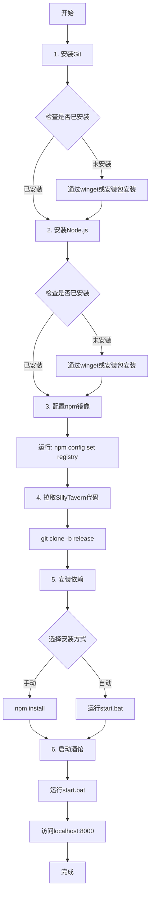

# Windows本地部署酒馆与clewd教程

!!! note "作者：方素琪（类脑dc@allenade_35238）"

	作者不对您在参考本教程时因误操作或其他原因造成的任何时间及其他损失负责。

## **欢迎来到SillyTavern的世界！**

这篇教程是该教程组中对你的电脑修改最小，尽量贴合新人的教程。我将会手把手的教你用你自己的Windows电脑来搭建一个可以畅玩的SillyTavern（以下可能被称为“酒馆”）。
这篇教程面向的是对于计算机（特指Windows系统）操作极其陌生的电脑萌新，所以里面的一些文本对于有使用命令行基础尤其是对git有一定了解的的新人来说十分简单。
啊？为什么没有Linux？你都用Linux了git clone很难吗？哪怕去研究研究docker部署。
哦对了，为了避免浪费时间，请注意：

!!! warning "注意"

	在 Windows 7 及以下版本的Windows系统上是不可能安装SillyTavern的，因为它无法运行 Node.js 18.16

## 0.安装流程一览

被冗长的目录吓到了？别怕！其实我只是把非常简单的步骤讲的非常细，总的来看步骤十分简单的！

**总体安装流程图**

总体安装流程图的作用是让你在具体看教程之前知道自己将要做什么，因此更加推荐要完整的查看教程的内容。（鸣谢络络画的代码块和总结内容）

 

不要被字数吓到，一句话总结流程：

**装Git和Node → 拉代码 → 双击自动安装依赖并运行 → 打开浏览器开玩！**

!!! note

    如果你对从github拉取代码有一定了解，那么可以根据流程图自行安装来节省时间。

## 1.Hello SillyTavern!——来认识一下酒馆和Clewd吧！

### 1.1关于酒馆

所以你可能会疑惑，SillyTavern到底是什么东西？
在 [GitHub的官方页面](https://github.com/SillyTavern/SillyTavern) ，他们是这么写的：

!!! quote "酒馆"

    *SillyTavern 是一个可以安装在电脑（和安卓手机）上的用户界面，让您可以与文本生成的人工智能互动，并与您或社区创建的角色聊天/玩角色扮演游戏。SillyTavern 是 TavernAI 1.2.8 的一个分支，正在进行更积极地开发，并添加了许多重要功能。在这一点上，它可以被视为完全独立的程序。*

看不懂？没事，说实话这就和你在安装应用程序时必须点的隐私协议和用户条款一样，文邹邹的不知所云。
让我来用简单的方式来说一下：
比如从前有一个ai源（例如你可能熟知的chatGPT），现在你需要让ai说一些……不太能那么上得了台面的东西。
显然你不可能去官网，直接给ai打字说：“**哦老天我的下面要着起来了,快给我写一个让我舒服舒服的文章。”**

<figure markdown="span">
  { loading=lazy }
  <figcaption>图1.1，错误的对话方法</figcaption>
</figure>

那么这个时候酒馆的用处就体现了：
**酒馆可以让你通过非官网的方式来和ai对话，提供给你一个方便管理promot（提示词）的平台。**
有人可能会问：promot是什么？
你可以暂时理解为，角色卡啊，世界书啊这些在进行角色扮演之前要提前发送给ai的东西。

