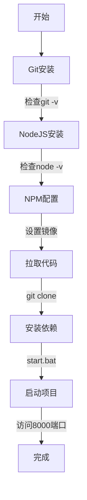

# Windows本地部署酒馆与clewd教程

!!! note "作者：方素琪（类脑dc@allenade_35238）"

	作者不对您在参考本教程时因误操作或其他原因造成的任何时间及其他损失负责。

## **欢迎来到SillyTavern的世界！**

这篇教程是该教程组中对你的电脑修改最小，尽量贴合新人的教程。我将会手把手的教你用你自己的Windows电脑来搭建一个可以畅玩的SillyTavern（以下可能被称为“酒馆”）。
这篇教程面向的是对于计算机（特指Windows系统）操作极其陌生的电脑萌新，所以里面的一些文本对于有使用命令行基础尤其是对git有一定了解的的新人来说十分简单。
啊？为什么没有Linux？你都用Linux了git clone很难吗？哪怕去研究研究docker部署。
哦对了，为了避免浪费时间，请注意：

!!! warning "注意"

	在 Windows 7 及以下版本的Windows系统上是不可能安装SillyTavern的，因为它无法运行 Node.js 18.16

## 0.安装流程一览

被冗长的目录吓到了？别怕！其实我只是把非常简单的步骤讲的非常细，总的来看步骤十分简单的！

**总体安装流程图**

总体安装流程图的作用是让你在具体看教程之前知道自己将要做什么，因此更加推荐要完整的查看教程的内容。（鸣谢络络画的代码块和总结内容）


 

不要被字数吓到，一句话总结流程：

**装Git和Node → 拉代码 → 双击自动安装依赖并运行 → 打开浏览器开玩！**

!!! note

    如果你对从github拉取代码有一定了解，那么可以根据流程图自行安装来节省时间。

## 1.Hello SillyTavern!——来认识一下酒馆和Clewd吧！

### 1.1关于酒馆

所以你可能会疑惑，SillyTavern到底是什么东西？
在 [GitHub的官方页面](https://github.com/SillyTavern/SillyTavern) ，他们是这么写的：

!!! quote "酒馆"

    **SillyTavern 是一个可以安装在电脑（和安卓手机）上的用户界面，让您可以与文本生成的人工智能互动，并与您或社区创建的角色聊天/玩角色扮演游戏。SillyTavern 是 TavernAI 1.2.8 的一个分支，正在进行更积极地开发，并添加了许多重要功能。在这一点上，它可以被视为完全独立的程序。**

看不懂？没事，说实话这就和你在安装应用程序时必须点的隐私协议和用户条款一样，文邹邹的不知所云。
让我来用简单的方式来说一下：
比如从前有一个ai源（例如你可能熟知的chatGPT），现在你需要让ai说一些……不太能那么上得了台面的东西。
显然你不可能去官网，直接给ai打字说：“**哦老天我的下面要着起来了,快给我写一个让我舒服舒服的文章。”**

<figure markdown="span">
  { loading=lazy }
  <figcaption>图1.1，错误的对话方法</figcaption>
</figure>

那么这个时候酒馆的用处就体现了：
**酒馆可以让你通过非官网的方式来和ai对话，提供给你一个方便管理promot（提示词）的平台。**
有人可能会问：promot是什么？
你可以暂时理解为，角色卡啊，世界书啊这些在进行角色扮演之前要提前发送给ai的东西。

### 1.2关于Clewd

!!! note

    （作者注——这部分在施工）

还是看不懂？不用担心！相信你在搭建和使用酒馆的过程中，一定会慢慢理解这些文字的意思。
毕竟，只有人们的社会实践，才是人们对于外界认识的真理性的标准。

## 2.我的工具箱在哪里？——安装git与node

额，什么是git和node？
好吧，出于对创作者的尊重，请允许我把官方说明贴在这里（点击名字以跳转到官网）：
[Git](https://git-scm.com)是一个免费的开源分布式版本控制系统，旨在处理从小型到快速高效的超大型项目。
[Node.js](https://nodejs.org)是一个免费的开源跨平台 JavaScript 运行时环境。它允许开发人员创建服务器、Web 应用程序、命令行工具和脚本。
你知道我要说什么——这又是一个典型的“**隐私协议和用户条款**”类型的语言。

你可以简单理解为：
**酒馆就像你要玩你家里的拼装玩具。git是你放玩具的架子——你需要先去架子那里拿到你的玩具。
而node则是你拼装时候需要的工具箱——没有工具箱你就算拿到了玩具也拼不出来。**
闲话少叙，让我们开始吧！

!!! note "PS"

    作者本人的所有电脑在写本教程时，均已安装了git和node故这一部分的教程**未经本人测试，但已经经过了多方查证和校对力图准确易懂。**

!!! warning

    此外值得指出的是，在酒馆的官网提供了使用github desktop安装酒馆的方法。但作者主观认为对新手不友好,故极其不推荐。这里给出官网这一教程的**链接**。除此之外,在本教程组中也有关于这一[**安装方法的具体描述**](gitdesk.md)（非本教程作者所写)本教程组也有**使用Windows的docker部署的方法**(非本教程作者所写）操作简单无脑。但为了保护对于编程不甚了解的各位的电脑远离一些可能一辈子都用不上的奇怪软件，本教程不会详细展开这类方法，感兴趣的大家欢迎自行尝试。

### 2.1安装git

#### 2.1.1确认是否安装git

首先确认你是否已经安装了git：
按windows徽标+r键，然后在框内输入 `cmd/powershell`然后点击“确定”来打开`cmd/powershell`

<figure markdown="span">
  { loading=lazy }
  <figcaption>图2.1，使用组合键打开cmd</figcaption>
</figure>

!!! note "注"

    作者个人习惯使用cmd，接下来的示例全部使用cmd演示，powershell同理。

在打开cmd后，你会看到如图所示的黑色窗口（powershell有可能是蓝色），接下来输入代码：

```bash
git -v
```

然后回车。请注意git与-v中间有空格，之后的命令不再强调类似的空格。
接下来，你会看到两种可能：

1. 像这样提示`git version xxxxxx`

<figure markdown="span">
  { loading=lazy }
  <figcaption>图2.2，成功安装git</figcaption>
</figure>

这代表着你的电脑已经按照了git，请接下来转到安装node步继续。

1. 像这样提示“git不是内部或外部命令，也不是可运行的程序或批处理文件”

<figure markdown="span">
  { loading=lazy }
  <figcaption>图2.3，未安装git</figcaption>
</figure>

这代表你的电脑尚未安装git，请继续。

#### 2.1.2开始安装git
有两种方式安装git：使用winget安装和下载安装包安装。

##### 2.1.2.1使用winget安装git（推荐）
我已经懒到去找winget的官方说明了，所以不要管这是什么，让我们继续，好吗？
对了，你关闭了cmd吗？没有？很好，让我们继续。如果关掉了也不要紧，重新打开便是。接下来输入：
``` 
winget install --id Git.Git -e --source winget
```

然后回车。如果不出意外，应该显示如下：

<figure markdown="span">
  { loading=lazy }
  <figcaption>图2.4,使用winget安装git</figcaption>
</figure>

##### 2.1.2.2使用安装包安装git

好吧好吧，我知道我理解，总有人在使用命令行的时候遇到各种各样的问题。
要么自己的老旧电脑没有winget，要么不知道为什么使用了LTSC但是不愿意安装winget，要么就是单纯的对命令行控制电脑感到无所适从，要么就是家里年迈的老父亲忽然窜出来，说什么表叔的邻居的丈夫的外甥在上微机课的时候敲了两次命令行，电脑直接冒烟了，从此对命令行产生了深深的心理阴影。

不管怎么说，这里也有不敲命令行的办法：
首先在**官网的下载页面**，下载你需要的windows安装包，
!!! warning "注意"

    如果你的操作系统是32位的,作者个人建议请放弃安装酒馆。

<figure markdown="span">
  { loading=lazy }
  <figcaption>图2.5 在官网下载git安装包</figcaption>
</figure>

然后一路默认安装即可，这里的界面就像你在安装qq等众多windows的应用程序的安装程序一样，是不是很亲切？
安装页面太多，为了保证排版，就不一一截图了。
总之，无论你是用哪种方法，**都要再次验证是否正常安装**，然后就可以进行下一步安装node了。

### 2.2安装node
安装node和安装git的方法高度一致（尤其对于winget来说），故这一部分的教程不会详细描述。

#### 2.2.1确认是否安装node
和看git的方法一样，在cmd输入代码：
```
node -v
npm -v
```
然后回车。

<figure markdown="span">
  { loading=lazy }
  <figcaption>图2.6 检查node安装</figcaption>
</figure>

在这一步，有些人可能会遇见**无法加载文件xxx，因为在此系统上无法运行脚本**的报错，这是一个非常好解决的报错，详情请看附录一，或者自行查找解决方案。

#### 2.2.2开始安装node

##### 2.2.2.1使用winget安装node（推荐）

在命令行输入
```bash
winget install OpenJS.NodeJS.LTS
```
然后回车。
聪明的你可能注意到这和安装git的命令格式有些许不同，但这只是参数输入上的区别，所以不用在意。

##### 2.2.2.2使用安装包安装node

在[官网的下载页面](https://nodejs.org/zh-cn/download)进行下载。

<figure markdown="span">
  { loading=lazy }
  <figcaption>图2.7 下载页面</figcaption>
</figure>

随后一路next安装即可。

## 3.酒馆是怎样建成的——安装SillyTavern
!!! warning "注意"

    在进行下面的步骤之前，请确保你的电脑能够连接上外网，不过既然你都看到了这篇教程，想来这对你来说，应该并不是一件难事。

### 3.1配置node镜像（可选，推荐）

众所周知的原因，国内的电脑想要访问国外的网站总是很麻烦的。
对于我们的工具箱node来说，我们一会要进行的配置就像是从工具箱拿工具，而从邻居家拿工具和从自己家拿工具显然差别很大。
所以我们要配置node镜像，告诉电脑：你要从我家里已经复制好的工具箱里拿工具，而不是位于邻居家的官方的工具箱。

#### 3.1.1查看当前的npm镜像
在cmd中输入命令:
```
npm config get registry
```
来查看当前的源

可以看到，
上面是`https://registry.npmjs.org`，这是并不位于国内的官方源，如果你刚刚安装了node，那么你应该显示的是这个；
下面是`https://registry.npmmirror.com`，这是位于国内的淘宝源。

#### 3.1.2修改镜像

作者使用的是国内镜像是淘宝源，天知道为什么阿里巴巴不叫他阿里源而是叫淘宝源，听起来就像是你在网上购物时发现的，那种用广告告诉你这是来自淘宝源头加工厂的货物，反正和计算机是八竿子打不着的。
……
……
其实，阿里源听起来也挺土的，对吧？

修改镜像的命令是：

```bash
npm config set registry https://registry.npmmirror.com
```

- 如果你有自己中意的镜像源，只需要在命令里修改后面https开头的源地址即可。
- 在按回车之后等几秒，会弹出等待输入下一个命令的光标，
- 此时就代表着切换完成,我们可以再次运行查看命令来检查是否成功切换。

### 3.2安装SillyTavern

好消息！你终于来到了心心念念（也许）的安装SillyTavern环节！
更好的消息！最难的地方已经过去了！
~~所以，是不是还蛮简单的？~~

首先，选择或干脆新建一个文件夹作为安装SillyTavern的地方，然后点击路径，输入cmd来使cmd定位此处。

 { loading=lazy }
<figure markdown="span">
  { loading=lazy }
  <figcaption>图3.2-3.3</figcaption>
</figure>

然后输入代码来从GitHub上下载SillyTavern
```bash
git clone https://github.com/SillyTavern/SillyTavern -b release
```
或
```bash
git clone https://github.com/SillyTavern/SillyTavern -b staging
```
前者的release是稳定版，staging是测试版，如果不是有特殊需要下载稳定版即可。
当然了，你可能会遇见下面的状况：


这实际上还是之前提到的网络问题，所以我们可以使用镜像（这里暂时懒得写，请自行寻找合适的镜像源），或者打开clash的TUN模式来尝试。
总之，如果一切顺利，你会看见：


到此，我们成功的安装了SillyTavern。

!!! success "作者注"

    如果有需要的话，这一步的方法同样适用于安装clewd。
其中，clewd的拉取命令是
    ``` 
    git clone https://github.com/teralomaniac/clewd.git
    ```
    其余步骤与安装酒馆相同，不再赘述。

### 3.3安装依赖与运行酒馆
别急！千万别急！还有最后一步你就可以见到你心心念念的酒馆了！
在接下来两种方法二选一：

#### 3.3.1手动安装npm依赖（稳定）

还记得你之前安装的node吗？现在派上用场了！
在酒馆目录（注意！在安装完成后，git应该是新建一个文件夹的。所以如果你是像我一样一开始的目录是D:\SillyTavern，那么现在的酒馆目录应该是D:\SillyTavern\SillyTavern），运行命令是：
```
npm install
```
#### 3.3.2自动安装npm依赖（推荐）

如果你自己配置了镜像npm源，那么推荐用这个方法。
非常简单，一句话——双击start.bat。

最后，无论你用哪种方法安装了npm，在安装时会有小横条在一直转圈，其中可能会抛出几条错误——但是如果是npm warn开头的无需在意。
如果一切正常，那么会在几分钟后完成安装，耐心等待哦~

#### 3.3.3开始运行SillyTavern

随后，双击start.bat来打开酒馆（是的，你发现了，手动安装是可有可无的，其实手动安装只是为了定位可能出现的错误），直到出现如下代码：

!!! note "作者注："

    其实这里酒馆的官方文档提到不要用管理员运行start.bat,但是据我个人经验没什么区别。


系统可能会自动打开网页，也可能不会，如果没有的话，浏览器输入cmd里蓝色的地址，或者干脆按住ctrl键的同时点一下蓝色链接来跳转。

在浏览器里出现此界面代表你的SillyTavern安装成功！开始享受你的ai老婆（老公）吧~
在遇到各种问题的时候欢迎在dc戳我，或者在该教程的对应步骤处添加评论，我会经常来看看的！

## 附录
1. npm运行时的加载策略报错解决方案（施工中）
2. 安装报错（收集中）


