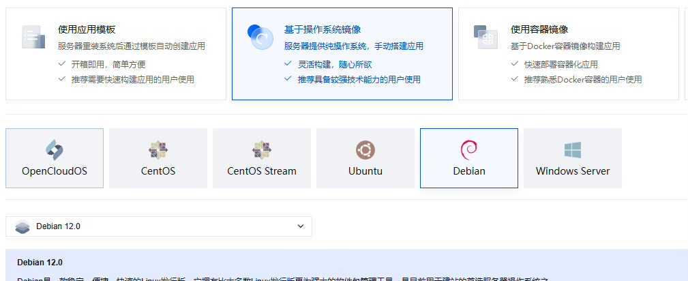

# VPS 云端部署酒馆与Clewd

!!! note "作者：染月青花"

	那么首先, 你要有一台云服务器, 请自行解决这个问题, 无论是选择几大服务器供应商, 还是什么奇怪的东西, 这点上请自行其便。唯一一点忠告就是, 尽量选择位置合适的境外服务器, 服务器自身既不在墙内(服务器可以畅通无阻的连上各家LLM), 并且服务器自身没有被墙(你自己的设备能畅通无阻的连上服务器)

## 1 服务器自身的配置

当你选择一台服务器之后,服务器供应商通常会给你提供一些可选的linux系统, windows server这个东西的部署不会包含在这里, 仅面向linux

### 1.1 系统的选择

系统的选择都没什么太大差别, debian/ubuntu或是其他什么你喜欢的,你只要知道你的系统如何使用包管理器和配置sshd就可以了(或者你知道什么, 熟悉什么, 就选什么),这一点上可以自行其便, 教程中将以 Debian12为例

{ loading=lazy }

然后, 在创建服务器实例的时候,记住你的服务器ip地址与填入的登录密钥

!!! danger "警告"

	**重点! 如果你不打算配置密钥对登录,那么一定要填入一个强密码, 超强密码,因为弱密码几乎肯定会被扫描脚本暴力破解,然后你的服务器就成了人家随意进出控制的玩具了,不要抱有侥幸心理, 在你的服务器被拿去当肉鸡之后,服务器商不仅会封掉你的服务器, 甚至不给你退钱,这也是最轻的损失, 重则你的API会被泄露被人刷爆！**

{ loading=lazy }
{ loading=lazy }

!!! warning "切记"

	记住你的密码

### 1.2 连接你的服务器

!!! info "PS"

	接下来的教程使用的 linux 发行版为: Debian12

Windows10/11几乎都自带有OpenSSH这一工具, 可以直接用于诸多与服务器相关的操作
1. 首先, 打开你的 Windows 终端 或者 Windows PowerShell
2. 接着你可以输入 
```
ssh -v
```
来查看你的ssh版本

{ loading=lazy }

那么在此之后, 你就可以通过 ssh root@xxx.xxx.xxx.xxx 来登录你的服务器
其中, @前面的部分为你的用户名, 一般新服务器默认为root
@之后的部分为你的服务器ip

### 1.3 服务器安全

那么进行到这一步了, 我们先等一下, 先不要急于连接, 已经建立的连接可以通过输入 exit 来退出

{ loading=lazy }

!!! warning "注意"

	如果你选择依赖强密码, 那么请跟随 1.3.1 修改ssh端口, 但这仍然是个具有风险的选择,强密码+高端口并不能完全保证服务器安全,或者, 在跟随 1.3.1 修改了端口之后, 进一步随着 1.3.2,去配置密钥对, 然后禁用密码登陆

#### 1.3.1 修改ssh端口

在windows终端中通过

```
ssh root@xxx.xxx.xxx.xxx
```

来登录你的服务器, 过程中会要求输入你的登录密码, 如果你还记得, 那么恭喜你, 你应该可以顺利登录并看到这样的界面

{ loading=lazy }

接着输入 `nano /etc/ssh/sshd_config` , 使用debian12自带的nano编辑器, 去修改sshd_config
将Port这一条修改为足够高的不常见端口:
范围: `10000 至 65535`
如果 Prot 前面带有#, 说明这一行被注释了, 删掉#Port前面的#取消注释, 应当如下图所示

**(别填个示例的12345!)**

{ loading=lazy }

之后, 使用 ++ctrl+o++ 快捷键来保存修改, 然后使用 ++ctrl+x++ 来退出

接着, 输入 

```bash
sudo systemctl restart sshd
```

重启ssh服务, 来应用修改

然后, 在你的服务器供应商网站的控制台中, 找到安全组/防火墙一类的页面, 将你的新的ssh登录端口进行放行

它看起来是这个样子:

{ loading=lazy }

点击添加规则：

{ loading=lazy }

来源选择 `全部IPv4地址 或 0.0.0.0/0`

如果你知晓自己的公网ip并确保它是固定不变的(视地区和运营商政策而定, 如果你不确定, 那么还是放行全部来源), 可以尝试将来源设为你的ip, 否则, 直接选择 全部IPv4地址 或 `0.0.0.0/0`

协议选择 TCP
端口填入你刚才设置的端口 12345

下一次在连接登录的时候, 默认的 `root@xxx.xxx.xxx.xxx` 方法去连接的是22端口, 这是不行的, 因为我们修改了端口, 那么, 在登录的时候, 需要使用 -p 这个参数去指定登录所使用的端口
如: 

```
ssh -p 12345 root@xxx.xxx.xxx.xxx
```


如果你真的很放心你的密码, 那么下一步的 1.3.2 就可以跳过了。


#### 1.3.2 配置密钥对登录

此时, 让我们回到win中, 输入 exit , 来退出登录, 结束ssh会话。

{ loading=lazy }

既然是密钥对登录, 显然, 我们需要一对密钥, 公钥与私钥
openssh已经自带了生成密钥对的功能

命令为:
```
ssh-keygen -t ed25519
```

你也可以添加 -f 参数去指定密钥生成在哪里, 如:
```
ssh-keygen -t ed25519 -f "C:\你的\目标\路径\文件名"
```
但, 为了方便你, 免得你找不到, 也方便后续配置config, 我建议你不要去改

在 `ssh-keygen -t ed25519` 回车之后

什么都不要动不要填, 直到出现如下内容:

{ loading=lazy }

于是, 你便可以进入这个目录去寻找你刚才生成的密钥对了

{ loading=lazy }

图中的 id_ed25519 与 id_25519.pub 就是你的私钥与公钥,

!!! danger "极其重要"

	这一对宝贝都要妥善保管好, 千万不得遗失,不然别管耶稣上帝还是三清和如来,你把他们找来他们也进不去你的服务器, 更别说你自己,你就是把欧姆弥赛亚找来都没用!!!

其中 id_ed25519 是私钥
首先你要做的就是, 使用文本软件打开 id_25519.pub , 这是你的公钥, 你需要将它放在服务器上

使用文本软件打开它, ++ctrl+a++ 全选, 然后 ++ctrl+c++ 复制里面的内容

{ loading=lazy }

连接登录你的服务器, 然后输入
```
nano .ssh/authorized_keys
```

来编辑配置你的密钥文件(如果不存在nano会自动创建).

{ loading=lazy }

将你的密钥粘贴进去(ctrl + v), 然后使用 ctrl + o 保存修改, ctrl + x 关闭

接着, 去使用 nano /etc/ssh/sshd_config

找到 `PubkeyAuthentication` 与 `PasswordAuthentication` 这两项
如果它们以#开头, 意味着它们被注释掉了, 首先, 删掉#, 取消他们的注释
将 `PasswordAuthentication` 设置为 no
将 `PubkeyAuthentication` 设置为 yes

(如果没有这两条, 请确保反复确认过没有这两条之后, 再将这两条追加到文件的末尾粘贴进去)
```
PasswordAuthentication no
PubkeyAuthentication yes
```

最后, 使用 ++ctrl+o++ 保存修改, ++ctrl+x++ 关闭, 输入
```
sudo systemctl restart sshd
```

重启ssh服务
那么, 服务器的配置就结束了
在登录的时候, 使用
```
ssh -i C:\你的\目标\路径\私钥文件名" -p 112345 root@xxx.xxx.xxx.xxx
```

去登录了

当然, 这一串太过冗长了, 过于麻烦了,对此, 解决方案就是:


在这个目录下创建一个名为 config 的文件(没有任何后缀)
以这个格式创建一份配置, 
```
Host my_server
  HostName xxx.xxx.xxx.xxx
  IdentityFile 这一行建议直接从文件管理器的地址栏复制, 然后加上你的私钥文件名
  Port 12345
  User root
```

之后保存, 你就可以使用 ssh my_server 来登录服务器了, OpenSSH会自动从这里读取你的配置

接下来, 终于到了你最期待的一步了

## 2. 部署酒馆与clewd

那么首先, 你需要先安装酒馆的部署环境

在linux系统上, 这是极其简易的

### 2.1 Git

首先, 安装 git , 如果你的系统不自带的话, 使用
```
git -v
```

来进行确认, 如果命令未找到/未知命令, 没有返回版本信息, 则说明你需要安装 git
对于Debian:
只需要使用这一行命令即可:
```
apt install git
```

出现这样的内容即是成功, 可输入`git -v` 进行验证

{ loading=lazy }

安装过程中可能会卡住询问[yes/no]或[y/n], 需要你确认是否要安装, 请输入 yes 或 y 并回车确认
对于其他linux发行版
自行使用其对应的包管理器安装 git

### Node.js

你只需要跟随 node.js 官网的内容走即可

{ loading=lazy }

输入这条命令输入并回车: 
```
curl -o- https://fnm.vercel.app/install | bash
```

{ loading=lazy }

!!! success "注意:"

	可能会提示缺少依赖软件,解决方案很简单缺什么安什么,OK! 代表已有,Missing! 代表缺失,例如图中缺失 unzip,那么就使用命令:
	```
	apt install unzip
	```
	来安装缺失的依赖软件


