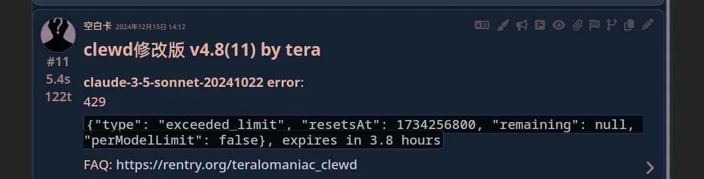
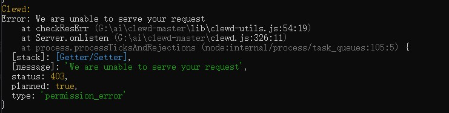
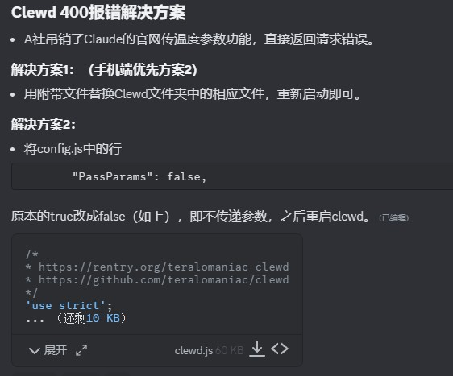

# Clewd报错大全(中转自己解决)

!!! note "作者：夕阳红木黑(类脑dc@Dreemurr)"

## 1. 429

原因:Cookie达到额度上限  
解决:更换/添加cookie或等待冷却 

## 2. 403

### 第一种

原因:大概率节点问题  
解决:尝试更换节点或使用
https://discord.com/channels/1134557553011998840/1299721367599448118 的方法

### 第二种

原因:无权限使用模型  
解决:使用claude-3-5-sonnet-20241022(使用cookie免费模型 我以后懒得改了)

## 3. 200

原因:A社服务器过载  
解决:等待

## 4. 413

原因:claude免费cookie只有20K上下文  
解决:调整上下文至20K 如果不行 将config中的padtxt调整至0 然后调整到25K/用总结

## 5. 400

原因:A社禁止cookie上传温度参数  
解决：

