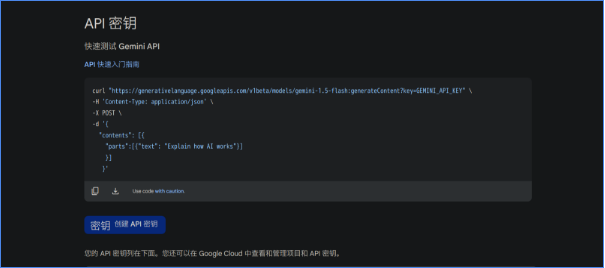
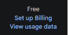
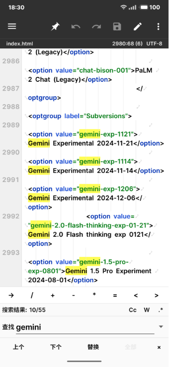
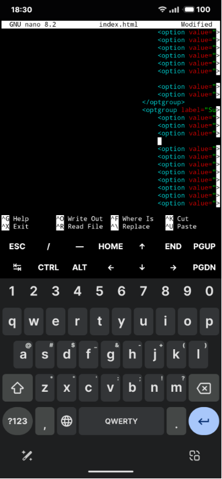
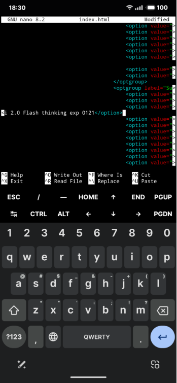

# Gemini（哈基米）模型介绍、获取和使用教程

!!!note "作者：络络（lolodesu_）"

      包含多项时效性内容，请注意甄别

      编写于2025年1月


Gemini（因为有时候有点笨且发音酷似流行网络梗，所以也被叫作哈基米x）是 Google 推出的大模型, 有多个版本。

!!! warning

      时效性内容，请注意日期，关注谷歌最新计划

对于酒馆RP来说目前主流 ~~（可以白嫖）~~ 的有：

Gemini-2.0-flash-exp（2.0flash）、

Gemini-2.0-flash-thinking-exp（thinking或1219）、

Gemini-Exp-1206（1206） (截止在2025年一月份)

(编写时Gemini-2.0-pro还没开放）

## 为什么要用Gemini？

### 优点
- **免费**
- **文笔不错、审查力度低到几乎没有**
- 响应速度极快
- 高难提示词环境发挥好
- 输出速度快适合前端卡
- 角色扮演能力强于GPT

### 缺点
- **会被截断**（因此也需要使用破限来防止截断）
- 可能不如Claude3.5s
- 容易封号
- 开启流式传输更容易被截断，因此重口**要求关闭流式传输**
- 需要时刻保证你的网络可以连接谷歌
- 实验性模型经常微调，可能每天的效果都不一样
- 对**格式**支持比较死板**有时会出错**，可能需要创作者使用更加规范的格式
- 笨笨，智商普遍认为不如同类产品claude系列

### 名词解释
- 前端卡：指使用前端助手的角色卡，使用了html、css、js等前端语言进行创作的卡，一般拥有漂亮的界面和互动选项，通过主页中是否被要求安装前端助手来判断
- 破限：是预设的功能之一，通过一些提示词来绕过审查模型进行输出NSFW内容
- 截断：检测到NSFW内容后，模型会截断输出（也就是话说一半不说了）
- 流式传输：开启后，模型会逐字逐句输出，而不是一次性输出全部内容，实时查看文本，减少等待时间。

## 如何获得API并使用在酒馆中？

### 需求:

Gemini是免费的，并且申请起来非常简单，**需要拥有闲置的谷歌账号**（可能是最难的部分）、适合的魔法（你都来这里了应该不用我说吧w）

违反用户条例的使用Gemini模型可能有小概率导致谷歌账号被封号，所以 **非常建议** 准备一个闲置的**谷歌小号**，避免主用账号被封禁。

### 步骤:

1. 浏览器启用无痕（隐私）模式
2. 注册谷歌号：将浏览器切换到英文语言、登录英文的谷歌网站进行注册、需要手机号验证（完成上诉操作可以使用+86的手机号）。
3. 或者购买谷歌号：也可以另行自己购买谷歌号，价格在1.5元左右，这里不放任何渠道请自行寻找。
4. 登录申请 Gmeini API 网站 <https://aistudio.google.com/apikey>  ，查看右上角是否是你的谷歌小号，如果不是请切换。（第一此进入可能会有一个用户协议勾选同意界面，同意就行啦。记得注意代理地址，若地址为香港会导致无法访问此页面）

{ loading=lazy }

5. 点击蓝色的**密钥创建API密钥（Creat API KEY)**按钮。
6. 在搜索栏中创建新项目或者选择默认项目、点击蓝色的密钥（创建密钥按钮）

{ loading=lazy }

7. 点击复制，这就是你的api，非常简单吧？（api会保留在这个网站下方，请记住或者收藏来方便下次查找）
8. 如果一个api不够你使用，建议创建**多个谷歌账号**申请api来进行轮询使用

注意： **单个谷歌号支持通过多项目来进行申请多个api，但封号率较高不推荐使用**

在酒馆中选择Google AI Studio，并填入API Key（和openai不同的是，测试按钮无法测试属于正常，可以通过测试消息按钮进行测试）（来自@NeilYuan:不能使用记得打开翻墙软件的TUN模式，或者更改sillytavern根目录下的config文件中的proxy。）

{ loading=lazy }

**附录1：**

!!! warning

      ⚠️时效性内容，请注意日期，关注谷歌最新计划

|**来自@Neil Yuan提供的数据（来自[Google ai studio](https://ai.google.dev/gemini-api/docs/models/gemini?hl=zh-cn) ）**||
| :- | :- |
|**Gemini 2.0 flash exp** |**1500次/天    10次/分钟**|
|**Gemini 1.5pro**|**50次/天          2次/分钟**|
|**Gemini exp 1206**|**100次/天**|
|**Gemini 2.0 flash thinking exp （1219）**|**1500次/天    10次/分钟**|

如果你明显感到单个账号使用Gemini无法满足需求，再考虑多账号轮询。

**附录2：**

如果你申请完发现plan这里不是免费而是去账单，那么等一会并刷新网页就好了

（注意，在变为free之前立刻使用可能会报错）

{ loading=lazy }

{ loading=lazy }

## 应该用什么预设？
千万**不要使用Claude的预设**，而是单独在预设、破限区中寻找Gemini的专属预设（可以勾选tag或者使用搜索bot，非常推荐使用搜索bot）

使用预设后应该仔细阅读对应预设的使用说明，根据要求切换分析/思维链等功能，很多预设针对不同的模型设置了不同的选项。

## 关于轮询

### ZerxZLib扩展
和其他扩展一样，在扩展那一页点击安装，并填入此链接（需要魔法网络环境）：
<https://github.com/ZerxZ/SillyTavern-Extension-ZerxzLib>

此扩展自带完善的使用说明，以及gemini报错分析表格，非常好用。

### 注意事项
此扩展自带html注入功能，此功能会与前端助手有部分冲突，如果你发现自己玩前端卡出现bug，请尝试关闭此扩展的html注入功能。

### 错误代码对照表
**下表来源于ZerxZLib扩展和@NeilYuan的补充**

|报错|原因或解决方案|
| :-: | :-: |
|429/Resource has been exhausted|撞到速率上限了，请等一会，若还是出现此报错请将最大上下文调整至 50k 以下|
|Internal Server Error|手机端遇到请换成 clash，不要使用类如\*\*VPN、\*\* 加速器等第三方梯子软件，pc 端用户请打开服务模式和 tun 模式，若仍出现此报错需要检查一下反向代理-代理地址中是否留空，若有地址请删掉，还有可能是您的输入上下文过长。调高酒馆里的最大上下文长度，注意不要超过模型能接受的|
|User location is not supported for the API use.|节点处于被限制的国家，请更换节点(美国最优先，请勿选择欧洲、中国香港、俄罗斯等地区)|
|Too Many Requests|重刷过于频繁，等待一分钟，若无效则本日请求已达上限|
|Bad request|网络环境出错或 API 已死（账号或项目被封禁）|
|API key expired. Please renew the API key|API key 已过期或被删除|
|The model is overloaded. Please try later|此模型暂时闭馆微调，暂停开放，请换用别的模型或等待一段时间|
|Please use a valid role: user, model.|你使用了需要打补丁的预设，请换不需要补丁的预设或打补丁|
|User location is not supported for the API use without a billing account linked.|处在 Google 政策限制免费层级的地区(如英国、意大利)|
|API key not valid. Please pass a valid API key|API 返回错误，检查 API 是否可用|
|权限被拒绝：消费者已被暂停。|谷歌账号被封禁/api还没有转到免费层级|
|MakerSuite API returned no candidate|Prompt was blocked due to : OTHER 本次输出被截断，请关闭流式传输|
|Not Found|模型选择错误，请不要选择除 Gemini 系外的模型或 Gemini Ultra|
|MakerSuite Candidate text empty|还是截断，解决方法有很多，关闭一些全局世界书/更改输入内容/换版本更新一点的预设|
|403/Forbidden|账号或项目被封禁，API key 无法调用|

**【此内容来源于ZerxZ，未经授权，如有侵权请联系我或samb进行删除，discord：@lolodesu\_】**

## 关于Gemini-2.0-flash-thinking

!!! warning "时效性内容，请注意日期，关注谷歌最新计划"

      此内容编写于2025年1月时，具有一定时效性，如果你查看的日期相对较晚，请仔细调查你所在的时间是否具有有效性。

此模型目前具有**经常输出俄语、西班牙语等其他文字的问题，是谷歌官方的bug**，不是你的问题也不是预设和酒馆的问题。

这个模型是相对特殊的自带COT的模型，只有切换到staging分支并更新到最新版，在预设上方才会出现是否显示模型自带思维链的选项，请根据你使用的预设作者的要求来决定切换分支和更新酒馆。

以及预览阶段的上下文上限是 32K （32000），记得改小你酒馆聊天预设设置的上下文大小以避免 413/400 等错误。

## 如何添加酒馆还没更新的模型？

接下来的步骤较难，更推荐你使用编写好的脚本
https://github.com/LenAnderson/SillyTavern-CustomModels

### 步骤一：找到index.html文件
找到酒馆文件目录 ~:\SillyTavern\public-> 选择index.html文件，使用文本管理器（txt）打开，通过（Ctrl + F）搜寻
gemini-exp-1206

### 步骤二：查询模型名并添加代码
定位后->找到的位置如上形式的代码->按照他的格式放入新增代码（插入位置随意）

<option value="gemini-2.0-flash-thinking-exp-01-21">Gemini 2.0 Flash thinking exp 0121</option>
其中gemini-2.0-flash-thinking-exp-01-21的部分是你想要添加的模型名，后边的名字可以任意取，只要你能知道就可以没有要求，但要确保value="gemini-2.0-flash-thinking-exp-01-21"引号中的模型是谷歌官网中真实存在的。

怎么知道模型名具体是什么？
打开你获取API时候的网站在左侧点击上方create prompt，或者点开下边的网站
[Untitled prompt | Google AI Studio](https://aistudio.google.com/prompts/new_chat)
看右侧模型选择的下拉菜单按钮，可以选择模型名，其中用 - 连接，不包含空格的名字就是具体的模型名字，需要一字不差的加入到index.html中

关于模型更新新闻欢迎浏览类脑频道

{ loading=lazy }

## 手机端如何添加呢？

### 方法一：使用MT文件管理器
简单的方法就是下载MT文件管理器并连接Termux，非常简单我不会写详细的教程，放一下正常人类都能懂的教程啦

{ loading=lazy }

软件在哪里下载？懂得下载Discord的你应该知道怎么下载软件，我推荐在浏览器搜索coolapk下载酷安来找到MT文件管理器。

当然你也可以直接用终端来添加，使用termux终端进行编写需要你知道基础的Linux命令和简单的nano使用方法。

#### 终端操作步骤

1. 打开Termux终端，如果你开启终端会自动进入脚本界面，请找到退出方法或者用Ctrl+C终止指令来结束你的脚本界面
2. 现在你就来到终端根目录，输入 `ls` 来查看当前层级下的目录都有什么

示例：
```bash
root@lolo:-# ls
clewd            SillyTavern
myenv            st_promot
node-....（省略）
```

3. 看到SillyTavern了吗？那就是我们的目标，使用 `cd` 命令来进入文件夹（相当于你在windows上双击打开文件夹）一定要注意大小写><

示例：
```bash
root@lolo:-# cd SillyTavern/
root@lolo:~/SillyTavern# 
```

4. 这样就进入了SillyTavern文件夹！很棒哦，你可以再次使用ls来查看文件夹的内容，其中一个public文件夹就是我们所要找的index.html文件所在地！

示例：
```bash
root@lolo:~/SillyTavern# cd public/
root@lolo:~/SillyTavern/public#ls
css    lib.js    scripts    favicon.ico….（省略）
index.html …（省略）
```

5. 你可以看到我cd（进入目录）后用了ls（查看文件）发现了我们的index.html就在其中呢~！那么像在Windows一样打开文件开始编写需要怎样做呢？使用nano指令：

```bash
root@lolo:~/SillyTavern/public#nano index.html
```

哇...进入了一个很高级很黑客的界面呢，也许下次朋友聚会时候你可以打开这个文件假装自己是黑客用来装x（）

{ loading=lazy }

6. 让我们使用CTRL+F来进行查找吧~！CTRL就在你输入法的上方呢

你可以看到我的截图中已经打开了Ctrl+F的查找模式（一个Search对话条呢），现在让我们输入代码来定位，或者也可以长按选择paste（粘贴）：
```
gemini-exp-1206
```
（或者你也可以自己手打一个gemini-exp，大概就足够定位到了！）

就能看到以`<option value="gemini-2.0-flash-thinking-exp-01-21">Gemini 2.0 Flash thinking exp 0121</option>`开头这里，这里存放着所有可以选择的模型。

7. 之后我们要在他下方或者你随便找一个位置啦（要单独成一行才行）
   - 点击END键快速来到这一行的末尾
   - 然后敲击一个回车/换行
   - 然后敲击tab键盘（就是那个两个箭头反向的按钮哦）来到达和其他选项一样的层级

就像这样~！

{ loading=lazy }

8. 就是现在！粘贴！（粘贴后看起来可能像是在前边没对齐，不要慌张这是正常的！只是显示效果）
```html
<option value="gemini-2.0-flash-thinking-exp-01-21">Gemini 2.0 Flash thinking exp 0121</option>
```

{ loading=lazy }

9. 让我按一下HOME来到行首检查一下！

{ loading=lazy }

10. 太棒了你已经完全编辑好了呢，现在别忘记**保存文件**：
    - 使用CTRL+X来退出并保存
    - 他会问你Save modified buffer？（是否保存文件的意思）
    - 当然啦，回答Yes！，也就是按一下Y
    - File name....大概就是问你文件名？默认就是index.html呢完全正确不要改啦，让我们回车！
    - 然后你就退出nano界面了，这样子我们文件就编辑好了！

11. 重新启动一下酒馆让我们看看模型在不在？（如果你用的是自动脚本只需要重启Termux就好啦）

### 遇到问题？

上述教程如果有问题、错误、遇到麻烦，也欢迎来dc类脑私信络络@lolodesu_
