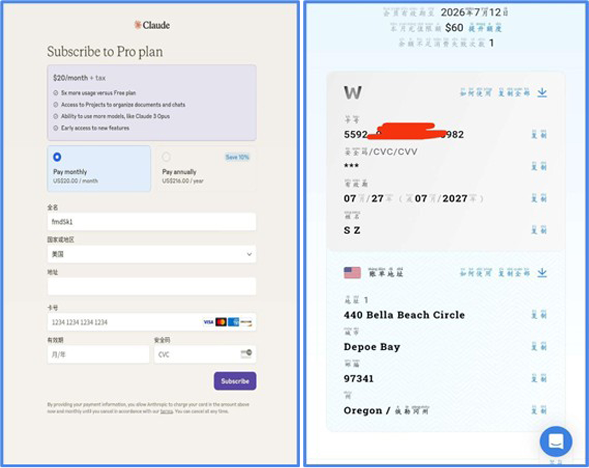

# Pro退款流教程

!!! note "作者：今晚的乌云很深 校订：络络"  

Pro退款流是指通过购买Pro会员，再因为玩法过于涩涩被封号退款 从而来达成免费使用(白嫖)的方法。  

**当前充值 Claude Pro 有三种方法：**
官网：官网直充、官网银联直充  
谷歌：谷歌银联中转  

根据自身情况酌情选择    

!!! info "PS"

	接下来的操作将默认你开启了梯子，登陆了Claoud官网，并创建了Claoud账户，手机用户默认已经下载了APP
	梯子请选择克劳德支持的地区或国家

## 1 三种方法的优劣

### 1.1 虚拟卡官网直充

优点：  
- 不需要你自己有银行卡  
- 享受官网140原价Pro(如果把手续费也算上的话那就不止了)  

缺点：  
- 贵(开会员才能开虚拟卡，先宰你20刀，每个平台可能略有出入)  
- 有手续费(每次充值/退款/退款都有3.5%的手续费，每个平台可能略有出入)  
- 退款周期长(1到2星期不等)  
- pro死的快(运气不好一两天似)  
- 有限额(一个月只能使用40~60美刀，不同平台有差距)  
- 不确定平台会不会卷铺盖跑路  

### 1.2 官网银联直充

优点：
- 官网直充享受140元原价订阅Pro
- 无限额

缺点：
- 只支持非长期银联卡(短期卡/信用卡；如果你的银行卡上没有有效期，恭喜你用不了)
- 笔者没有使用过这种方法，不确定pro被ban的风险有多大。

### 1.3 谷歌银联

优点：
- 可能很耐杀(有一段时间,根本杀不死）
- 接受所有类型的银联卡(长期卡/短期卡/信用卡只要你是银联就能绑)

缺点：
- 比官网直充贵了那么一点(20~30块钱，由于是人民币转新加坡币/泰币再转美元，因为汇率不可避免的会贵)
- 一个账号只能充一次Pro
- 无限额
- 绑卡时仅限于新加坡和泰国这两个节点
- 傻逼谷歌报错多(此卡的详细信息无效/发卡银行拒绝付款/跳手机号验证/跳银行卡验证)

**关于退款**
- 官网直充需要给a社发邮件
- 谷歌中转直接去谷歌商店"头像—付款与订阅"那里取消

## 2 充值具体操作流程

### 2.1 虚拟卡官网直充

1.选择一个虚拟信用卡平台(我不做任何推荐)  
2.然后开虚拟信用卡(不懂怎么开卡的可以问虚拟信用卡客服)  
3.开好之后这个页面(不同平台略有差距) 

一一对应抄上去就行了，然后点紫色的按钮，订阅即完成。

### 2.2 银联官网直充

1.卡号、有效期，安全码直接抄上去  
2.国家和地区直接百度随便搜一个填上  
3.然后按紫色按钮订阅验证完事 (我是长期卡没具体操作过)   

### 2.3 谷歌银联中转

#### 2.3.1 名词说明

- 谷歌商店绑上银联的账号统称为"付款账号"
- 在克劳德APP上完成充值的账号统称为"充值Pro号"

#### 2.3.2 事先准备

- 一个老谷歌账号作为付款账号使用
- 一个克劳德账号作为充值Pro号
- 去自己银行卡的银行APP里把跨境支付开启（开不了也没关系，跟跨境支付有关的全开即可）

#### 2.3.3 注意事项

- 谷歌商店仅支持新加坡和泰国地区绑银联卡
- 梯子节点也只能是这两个地区的(绑卡时限制)
- 推荐使用小地方银行的银行卡，更不容易跳"发卡机构拒绝付款"
- 直接在谷歌商店添加账号不能太多，建议登录到第三方邮箱
- 一个付款账号只支持充值一个Pro，多个Pro需要删除已充过Pro的付款账号(建议在备忘录记录账号密码)

#### 2.3.4 操作步骤

**第一步：**

- 准备一个谷歌账号（越老越好，不容易跳验证）

**第二步：**

- 下载谷歌商店
- 下载Claude（直接在谷歌商店搜索）

**第三步：**

- 谷歌商店绑卡（成功可能性非常玄学）

	- 确保自己的魔法环境！（不要选香港来绑卡，Claude无法在香港使用）
	- 主页右上角头像
	- 付款与订阅
	- 付款方式
	- 添加信用卡或借记卡
	- 输入卡号
	- 接收验证码完成绑定
	- 常见疑难解答
		- 卡的详细信息无效：可能是节点问题不够纯净，建议静置1-2天后重试银行卡
		- 机构拒绝付款：换个账号或换张银行卡

**第四步：**

- 注册/准备克劳德账号（谷歌/微软邮箱或谷歌账号登录皆可）
- 登录克劳德APP进行充值
- 点击紫色充值按钮（Upgrade)
- 充值结束后建议立即关闭订阅避免夜长梦多

!!! warning "充值注意事项"

	银行APP把跨境支付开了，只要跟跨境支付有关并且能开的，全开
	克劳德APP会拉取谷歌商店账号付款，切换付款账号的位置一般在设置>Google服务>头像>管理此设备账号>账号Google（App只会拉取第1个账号用于付款，所以要保证你的付款账号在第1个）
	付款账号地区影响付款：
	- 泰国地区显示799泰铢
	- 新加坡地区需切换为新加坡节点才显示充值按钮（29.9新加坡币）

**第五步：关闭订阅**

- 右上角头像>billing>Manage Subscriptions>选择你的Claude订阅进行取消

**第六步：提取cookie并用clewd连接酒馆**

- 在浏览器打开一个隐私窗口，登录Claude，打开F12>网络(network)>筛选器输入框中输入chat_>对claude发送一条消息>在F12的窗口下方点一个项目，并寻找请求cookie栏目中以seesionKey=sk-xxx-xxx--xxxxxxxxxxxx-xxxxx-xxxxxxxAA为值的一条，复制下来，这就是你的cookie。

- 接下来移步Clewd教程吧w

**第七步：**

- 从现在开始确保在30天内将你的账号被封禁，用途太正规或者玩太清水可能会难封，可以去类脑中的求封区让大家帮你封号。

## 3 常见问题解答

Q: 退款周期是多长？  
A: 因银行而异，农行次日即可到账，建设银行最慢4-5天  
Q: 为什么充值Pro账号邮箱收不到付款邮件？  
A: 所有退款和充值邮件发送至付款账号邮箱  
Q: 付款账号被封但充值Pro号存活，退款去向？  
A: 直接退回银行卡，可登录充值Pro号官网查看  
Q: 使用什么邮箱发送封号请求？  
A: 使用充值Pro号的账号邮箱  
Q: 充值Pro号订阅期间被封（谷歌/微软封禁）对使用和退款影响？  
A: 暂无相关案例参考  
Q: 提取饼干应提取哪个账号？  
A: 提取充值Pro号的饼干  

!!! warning "ios用户注意"

	不要去用苹果的充值渠道，苹果给你退款两次之后，大概率会不退了