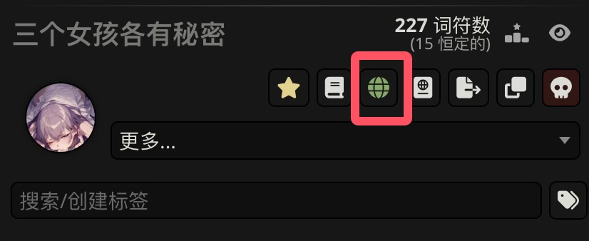
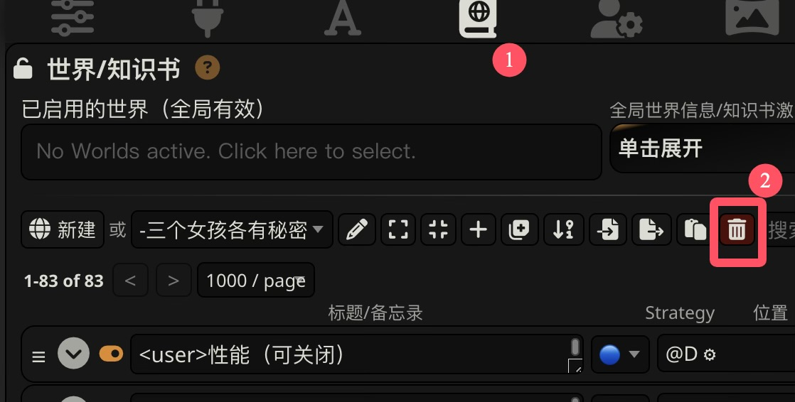
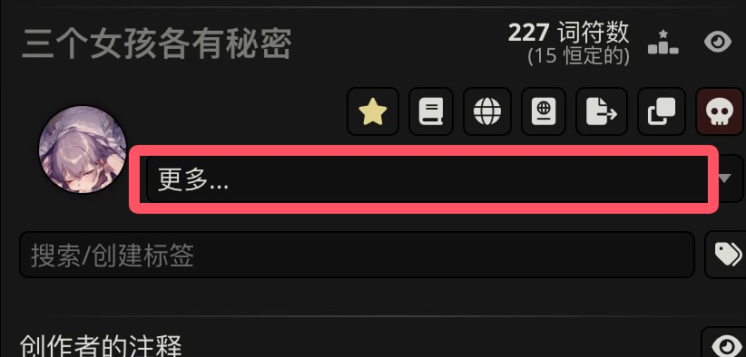
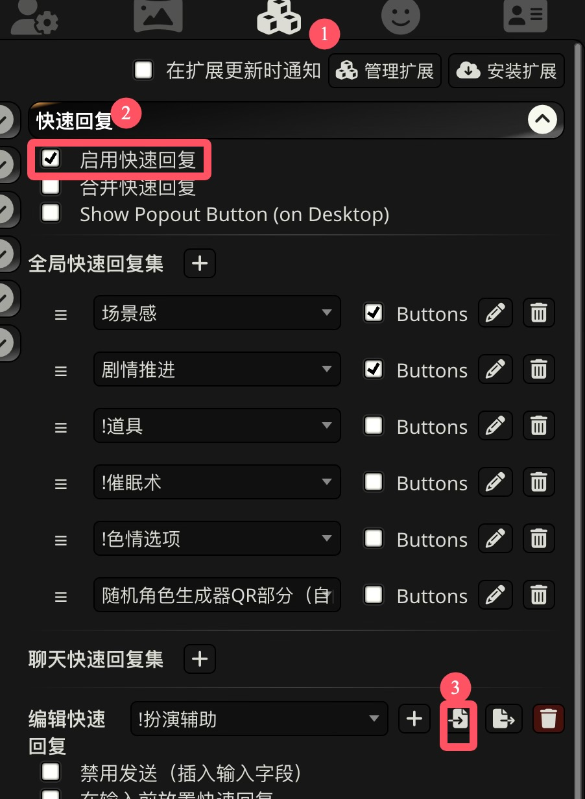
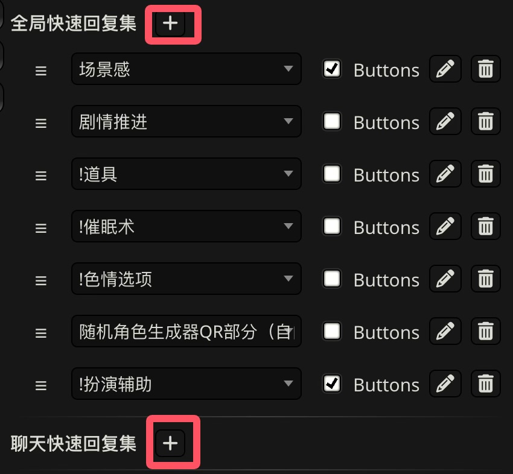
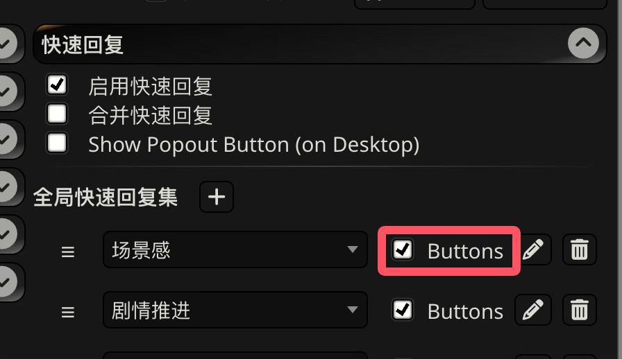
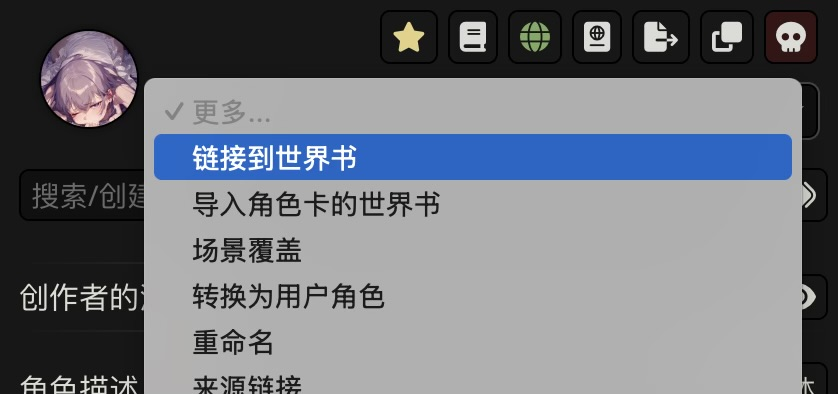
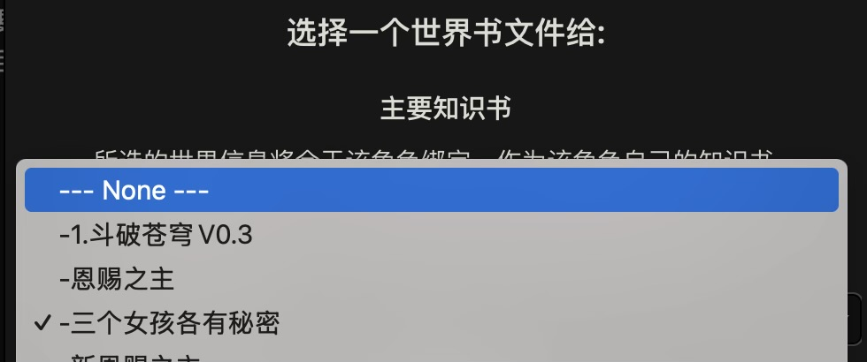

# 正确导入/导出更新后角色卡的方法

!!! note "信息"

	原帖正确导入新角色卡的方法：https://sillytavern-stage-girls-dog.readthedocs.io/common_issue/import_updated_card

	原帖正确导出新角色卡的方法：https://sillytavern-stage-girls-dog.readthedocs.io/common_issue/export_updated_card

## 导入更新后的角色卡
角色卡往往有世界书，而直接导入角色卡并不能替换世界书。

要更新角色卡，应该按以下步骤。

### 删除世界书

点击角色卡界面的**绿色地球**图标，从而跳转到世界书，删除它。

{ loading=lazy }
{ loading=lazy }

删除之后，地球会变成**白色**
{ loading=lazy }

## 更新角色卡

点击更多 ‣ 替换/更新，选择下载的新版角色卡。

{ loading=lazy }

### 导入新的世界书

再点击由于没导入世界书而呈白色的地球图标，从而导入世界书。

{ loading=lazy }

### 确认局部正则

一般来说，更新角色卡时会自动更新局部正则，
但可能没有被启用。建议确认一下它有没有被正常启用。

{ loading=lazy }

## 导入快速回复

角色卡并不自带快速回复，对于有快速回复的卡，你需要额外下载作者提供的快速回复文件。如果下载下来是压缩包，那么你还需要解压（百度怎么解压谢谢喵）。

下载好后，我们需要导入并启用快速回复。

### 导入

首先按图导入快速回复：

{ loading=lazy }

### 添加

- 在导入完成后，我们需要将它添加到快速回复集中。
	- 全局快速回复集：在所有角色卡的所有聊天中生效。
	- 聊天快速回复集：只在当前聊天中生效。即使同一张角色卡新建了聊天，也是使用独立的聊天快速回复集。

{ loading=lazy }

!!! warning "注意："

	在某些版本下，如果快速回复集中已经有选择快速回复时排列于第一位的快速回复，添加快速回复会失败。

	你需要先将该快速回复换成别的快速回复，等添加后再把它改回去。

	例如下图中如果快速回复集中已经有“!扮演辅助”，在一些版本下不能直接成功添加别的快速回复。

	**更建议你升级酒馆版本。**

### 启用或禁用按钮

在快速回复集中有一个选项buttons，它并不是启用/禁用快速回复。

{ loading=lazy }

buttons的意思仅仅是：

- 这个快速回复是否要在键入消息的地方显示按钮，通过按钮你可以手动使用一些快速回复功能。

但是某些快速回复将部分功能设置为自动执行，

则即使关闭了buttons，它们依旧会自动执行。例如，这是快速回复的编辑界面：

{ loading=lazy }

## 导出更新后的角色卡

更新世界书后角色卡经常不能同步上，也就是说，导出的角色卡依旧保存的是更新前的世界书。

为了保证导出的角色卡绑定最新的世界书，可以解绑世界书让它绑定 --- None ---，然后再重新绑定世界书。

{ loading=lazy }
{ loading=lazy }
{ loading=lazy }

