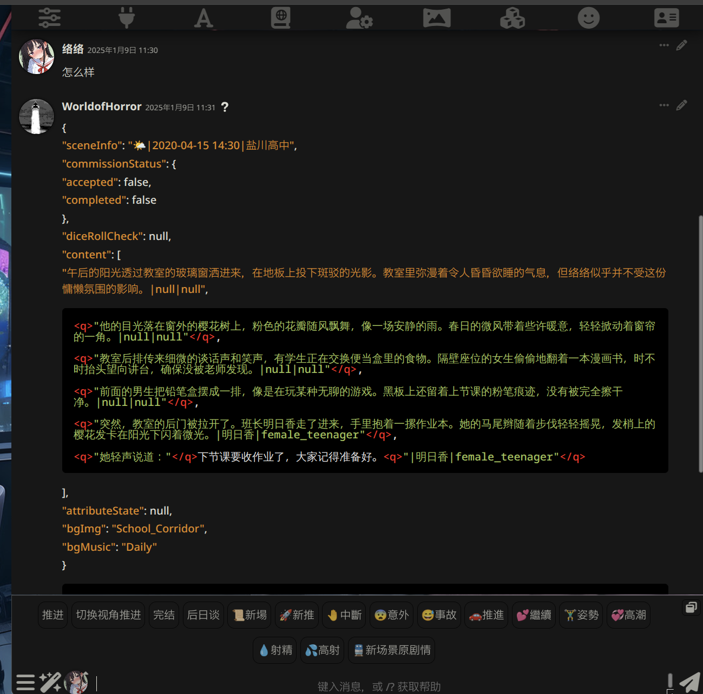
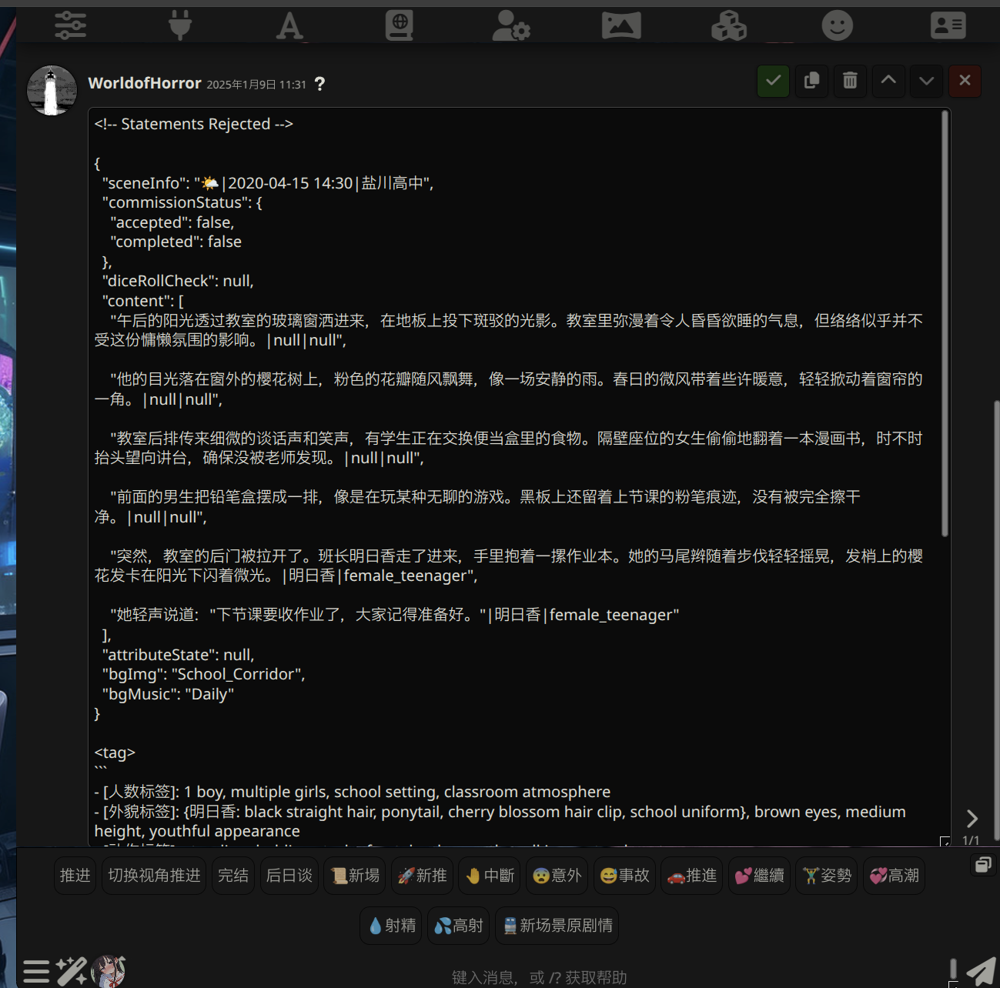
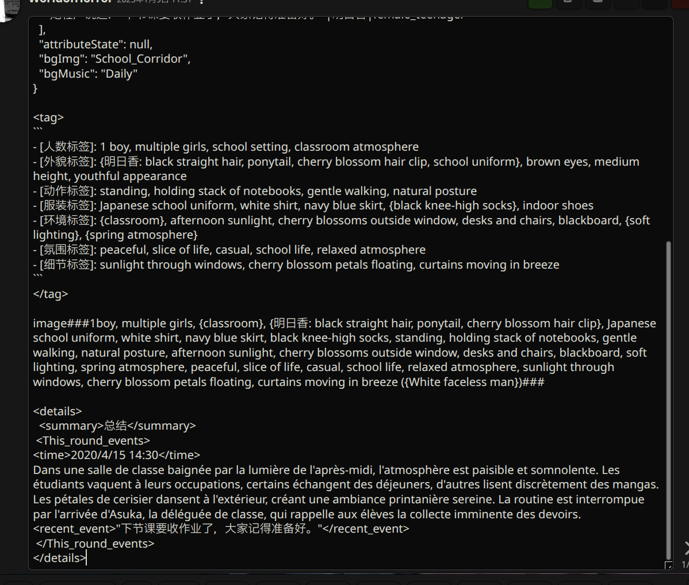

# 前端卡问题自查指南

!!! note "作者"

    作者：络络（lolodesu_）

本帖存在的初衷是方便新人自行进行问题的解决，减缓创作者解答压力，创作者和类脑无任何收益，请不要**无脑提问**，提问前请确保你检查过了以下选项，之后按照提问方法进行提问。

## API与模型自查

小心部分淘宝商/其他中小渠道商可能会在所谓的Claude API中灌水，如果你是这些渠道请检查自己的模型，并去询问服务商。

- 查看类脑站内此楼自查: [类脑| ⛔警示| 有效甄别模型方法| durvis](https://discord.com/channels/1134557553011998840/1231430861707018332/1309891171346284634)
- 站内公益API已经过测试，基本可以正常使用，字数少等问题是正常情况

## 前端助手配置

### 安装方法

[类脑| 酒馆插件| 前端助手| KAKAA](https://discord.com/channels/1134557553011998840/1296494001406345318/1296494176015351808)

> 内容引用自KAKKA:
> 
> 首先，最好你的酒馆能连上外网，也就是梯子要起效，不然可能安装失败
> 
> 点击酒馆上方的扩展图标，选择安装扩展，在弹出框内**二选一**任选一个链接填入：
> - https://gitlab.com/novi028/JS-Slash-Runner (不需要梯子)
> - https://github.com/N0VI028/JS-Slash-Runner.git (需要梯子)
> 
> 保存即可，脚本启用和播放器默认是关闭的，请在扩展选项卡中的"前端助手"里手动开启，之后会记忆状态

### 更新方法

部分人反馈说点击更新没能更新到最新版，因此建议完全删除前端助手后重新下载安装（在扩展>管理扩展>下方找到已安装扩展中的前端助手，删除并再次使用上方链接进行安装）

**提示**：新版前端助手已支持自动检测设置，建议开启前端助手的"自动关闭不兼容选项"和"自动开启局部正则"功能。如果没有这些选项，请及时更新前端助手。

## 基础设置调整

### 必要开启项

- 开启【局部正则表达式】
- 开启【角色卡详情中的启用**扩展媒体**功能】
- 开启【**前端助手**】

### 必要关闭项

- 关闭【禁用外部媒体】
- 关闭【自动修复markdown】
- 关闭【**全局世界书**】（注意：只需在角色卡详情中启用即可，地球图标亮起表示成功）
- 关闭【**油猴脚本**/Gemini轮询扩展的**HTML注入器**】
- 关闭【酒馆聊天自动翻译插件和浏览器的**自动翻译**】

> 开启HTML代码注入器可能导致前端界面闪烁问题，空白，两次等多种错误，因此请一定要关闭。（包括Gemini轮询扩展中的Html注入器）

## 预设相关调整

- 关闭预设中的**COT/思维链/分析/正文/组织结构**等设定格式规则的功能

这些具有提供格式的功能大概率会与前端卡产生冲突。如仍然遇到格式问题，建议询问预设作者。参考提问模板："楼主大大我特别用喜欢你的预设，但是我在游玩前端卡时出现了一些问题，想问问玩前端卡应该怎样选择预设条目？"

## 角色世界书确认

- 确保角色卡中的世界书正确导入
- 点击角色卡详情页中的小地球图标，使其处于点亮状态

## 版本检查

- 确保使用最新版本的酒馆

一些网站可能会推出云酒馆功能只需要登陆网页就能使用，但是**这些网站大多不是最新版酒馆**

## 浏览器兼容性

- 可尝试更换浏览器（不要用夸克）
- 移动端推荐使用Edge浏览器
- PC端推荐chrome、edge等浏览器

## 终极解决方案

- 如果以上方法都无效，可以尝试重新部署酒馆并重复以上步骤
  
> 注：重新部署较为繁琐，建议先在社区寻求帮助，无果后再考虑此方案

本文整理自在类脑的游玩经验，内容非个人原创，仅做了格式整理的微小工作。

欢迎任何创作者和用户自由转载和改写，无需征求授权，也不需要任何署名w

## 游玩建议

### 模型推荐（2025/1/4)
!!! warning "时效性内容注意"

	建议使用格式稳定的模型，经个人测试：
	- Claude 3.5s/3o
	- Gemini 2.0 Flash表现不错
	- Gemini 2.0 Flash thinking 1219 容易掉格式在调整过后也不错
	- Gemini exp1206输出很慢体验不佳就像在等恋爱对象回消息
	但请务必使用模型对应的预设，并**关闭预设中的格式相关设置**。

### 减少卡顿/改善加载过久

建议在设置中限制加载消息条数（如设置为5条），同时将前端助手深度调高或设为0，以避免过多消息导致系统卡顿。

### 节省上下文

使用隐藏正文提取摘要的正则功能时，请将深度设置至少为一楼，这样模型可以参考前文格式，保证输出更加稳定。

## 推荐提问方法

在提问前请务必先进行自查。创作者们都是在为爱发电，写卡的初衷是满足创作欲而非提供客服服务 😭。因此，**提问时请注意礼貌，同时建议可以适当表达对作者作品的喜爱**——这是支持创作者继续创作的唯一动力！

## 提问时候一定要包含以下内容

**［直接的完整截图］［点开信息右上角钢笔图标编辑按钮后信息的全部截图］**［文字描述问题一定要前因后果：如何触发、如何复现、具体表现、导致后果，已经尝试过的方法］

同时你也可以写出"我已经根据前端卡问题自查指南进行自查，但问题仍然存在"，来避免被回答指南内包含的事项浪费时间（前提是你真的自查完整了！）

编辑图标按钮【每条消息右上角的铅笔】(不同主题可能有所不同）：

---

### 示例：（图片不重要，重要的是截图方法）

**大佬我已经根据前端卡自查指南检查过了，前端助手更新、选项打开、关掉cot开启外部媒体等，但是还是不能正常显示界面，想问问这个格式是哪里出问题了？**

**【千万要将点开编辑按钮后的内容截全】**

## 常见QA

### 1. 我的格式出错了怎么办？

请同时截取游玩时的界面和编辑内容（点击消息右上角的笔图标）进行提问。

### 2. 全是代码块怎么回事？

首先确认已安装并更新前端助手，且已开启局部正则，然后判断是首楼出现还是仅在回复中出现。

- **首楼**：可能是酒馆设置出现问题。如果**已完成上述所有自查和调整步骤**，建议重新安装一份酒馆和前端助手进行测试，这种情况较为罕见 😭。

- **非首楼**：在确保完成所有自查步骤后，问题很可能是由以下原因造成：
  - 预设中仍有未关闭的格式设置造成干扰
  - 模型与预设不匹配
  - 使用的渠道质量存在问题
  - 正文被Gemini截断
  
如果无法确定预设中的格式内容，建议在预设发布帖中友善提问 🥺

### 3. 太卡了/加载好久啊

可以试试看：
- 打开浏览器的硬件加速
- 确保你的设备性能足够浏览大多数网页
- 更改设置中的加载信息条数（推荐做法是只加载5条并且让前端助手的深度为0，需要看更早的时候点击 more message即可）

### 4. 为啥我刚才明明正常显示画面了，过了一会回去看又不正常了？

点击编辑后再点击确认按钮达到刷新的效果，一般可以解决此类问题。

### 5. 为啥出现了两次窗口

是不是安了Gemini轮询插件？关掉试试看。

