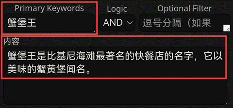
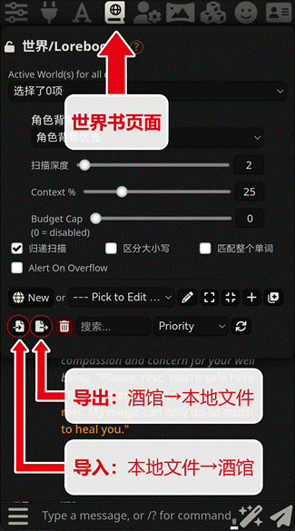

# 世界书

!!! note "作者：@破坏轨道"

## 1. 功能简介

!!!info "世界书 (Lorebooks)旨在为你的角色卡提供更为完整的背景信息。"

	它的功能类似于【词典】或【百科】：

	比如你正在玩一张**海绵宝宝**的角色卡，你发送一段话：“**海绵宝宝出发去蟹堡王工作。**”这时claude可能无法理解“蟹堡王”是什么。

	而如果你有以下世界书：
	{ loading=lazy }

	这时，你发送的话中的“蟹堡王”三个字会触发世界书，claude就能够理解蟹堡王是一家快餐店。

**世界书的最基本使用方式是【触发】，即以关键词 (Keywords) 触发内容 (Content)**

## 2. 基础操作

你可以下载别人的世界书[（类脑Discord频道）](https://discord.com/invite/B7Wr25Z7BZ)，
也可以[创建自己的世界书](https://sqivg8d05rm.feishu.cn/docx/P2QrdeUbToJMBYxeLCQcEBfLnGg#doxcnKxSujFw78ImTUfthntXOZC)。仅通过本节内容，
你就能学会世界书最基本的操作方法。

!!! warning "注意"

	如果你已经会导入、绑定、创建等基础操作，请跳转至进阶使用继续阅读。

### 2.1 导入导出

!!! info "条目"

	本条目是指手动导入世界书，导入角色卡自带世界书的情况参见下文的自带绑定的角色世界书。

1. 在导入之前，先确认你下载的世界书的格式。世界书和破限一样，后缀是**.json**。

2. 打开酒馆，点击页面并导入json文件。

{ loading=lazy }

3. 导入成功后，下滑页面，就可以看到作者所创建的世界书了。

点击**左侧的小箭头**，可以打开查看每一条目的详细信息。一般来说，新手下载世界书后无需进行修改。

