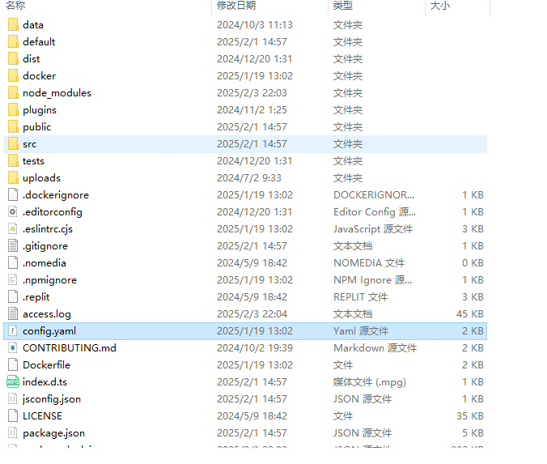
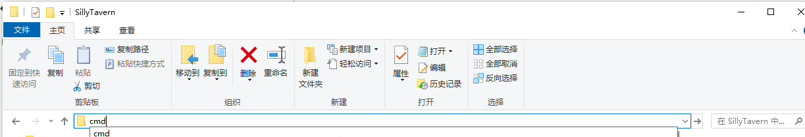
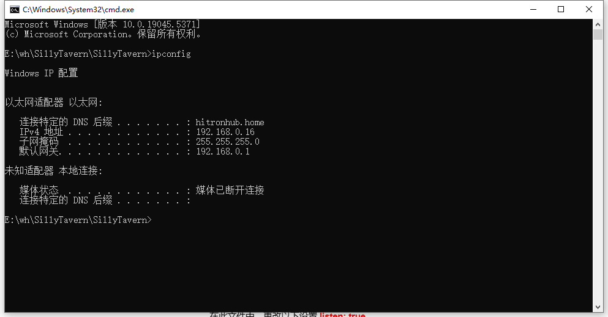

# 解放双手: 用移动设备连接搭建在PC端的酒馆

!!! note "总结"

    本教程旨在帮助用户解决在PC端使用酒馆时操作不便的问题,尤其是在打字等场景下。通过本教程,用户可以学习如何利用移动设备,在同一WIFI环境下,便捷地连接并使用搭建在PC端的酒馆或YOU反代。教程详细介绍了修改酒馆配置文件、查看内网IP地址以及在移动设备浏览器中进行连接的步骤。此外,还解答了关于在移动设备上使用YOU反代以及在非同一WIFI环境下连接酒馆的常见问题。让用户可以随时随地,解放双手,轻松畅玩酒馆!
"大家吼啊！你们最爱的泰罗又回来啦！"

相信很多人都有一种烦恼，那就是在电脑上游玩酒馆某些时候十分的不方便，在电脑上双手打字的时候不是很方便干别的事情，

总不能真去买自动化的杯子或者炮机吧？但是手机上部署酒馆从某种方面来讲又十分麻烦，尤其是在需要用到YOU反代的时候。

**今天我就给大家介绍一种可以方便的可以使用移动设备在同一WIFI环境下游玩电脑架设的酒馆/YOU反代的方法。**

**英文原文教程链接：https://docs.sillytavern.app/usage/remoteconnections/**

## 1. 事前准备

在进行设置前，你必须已经在PC端成功安装酒馆或者YOU反代，详见[此教程](/build/gitdesk.md)。

## 2. 更改酒馆设置。

- 在酒馆文件夹根目录下，用笔记本或者notepad++打开`/SillyTavern/config.yaml`文件。并且在此文件中,更改以下设置

```
listen: true
```

{ loading=lazy }
{ loading=lazy }

- 至少已经启动过酒馆一次。

- 查看你的内网IP.首先直接在文件夹路径栏输入cmd然后按回车打开命令行

{ loading=lazy }

在打开的命令行中，输入
```
ipconfig
```

命令然后按回车，你就会看到以下神秘输出，这样你就能看到默认网关地址和你的IPV4地址。此时记下你的电脑的IPV4地址，比如我的就是 `192.168.0.16`

{ loading=lazy }

再次在酒馆文件夹根目录下，用笔记本或者notepad++打开 `/SillyTavern/config.yaml` 文件。并且在此文件中，添加以下设置，其中的`192.168.*.*` 就是上面的默认网关地址的前2坨数字。并记住你的端口数字（默认8000），见下图第二行

```yaml

whitelist: 
	- 127.0.0.1
	- 192.168.*.*
```

{ loading=lazy }

## 3.原神启动！

使用同一WIFI网络下的任意移动设备，打开浏览器空白标签页（推荐chrome）,在地址栏输入上面你记下的IPV4地址和端口数字，并且进行组合。你就能无缝直连电脑架设的酒馆啦！

比如我的端口是8000，IPV4地址`192.168.0.16`，

组合之后就是 `192.168.0.16:8000`

## FAQ：

### 我该如何在移动设备使用you反代？

我假设你已经阅读并且成功在PC安装并设置且启动了YOU反代。详见此教程。那在移动设备端连接you反代的步骤是一模一样的，反代地址是`http://127.0.0.1:8080/v1`，密码随便填。

### 我该如何在非同一WIFI环境下连接自己家电脑架设的酒馆呢？比如在公司学校摸鱼涩涩？

可行！不过这个就稍微复杂的多，我们下期教程再讲吧！（逃）


