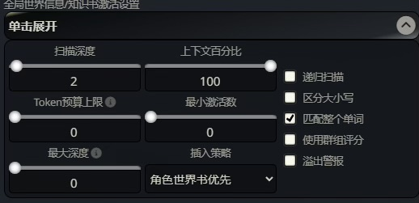
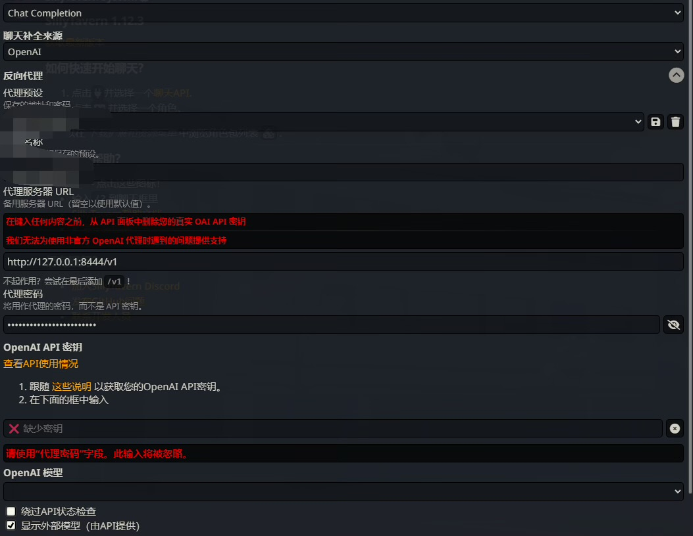
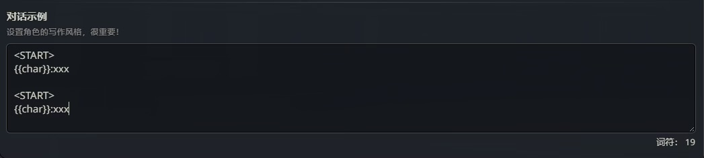

# 酒馆常见问题

!!! note "作者：夕阳红木黑(Dreemurr)"

## 1. 预设/破限

二者一个意思
在酒馆的
导入

{ loading=lazy }

## 2. 世界书不生效

{ loading=lazy }

检查世界书设置 只推荐这样设置

如果角色卡有特殊说明按照作者说的走

## 3. 角色卡添加多条开头

{ loading=lazy }

## 4. 角色卡链接世界书

{ loading=lazy }

## 5. 酒馆无法链接

检查反向代理中的内容
{ loading=lazy }

按照自己需求的内容填写
Clewd不要点击测试消息 是没有意义的

## 6. 角色卡对话示例

{ loading=lazy }

保证以此为格式 必须有一个<START>和{{char}}

## 7. 角色卡高级定义

{ loading=lazy }
要写东西在开头加{{original}}
否则会将预设内容替换掉

## 8. Token报错

{ loading=lazy }
解锁上下文大小并将预设内的上下文调整至大于角色卡token

## 9. 角色回复时出现的COT

{ loading=lazy }

类似这种统称cot

去预设页面下载对应正则导入

## 10. 关于正则

正则大部分用于美化角色卡/删除cot

正则只在某些特殊情况下才能影响AI的输出内容

所以类似“有没有xxx正则可以输出xxxx文风的”

问题是没有意义的

