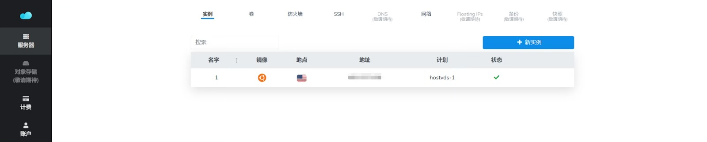

# VPS酒馆更新
!!! note "作者"

	dc：报告，我想尿尿

首先我们需要下载一个软件，这个软件是必须的软件名：MobaXterm

其次需要打开你购买服务器的网站查看服务器地址，马赛克位置就是地址
{ loading=lazy }
打开下载的软件点击左上角会话
{ loading=lazy }
点击ssh在远程主机位置输入服务器地址
{ loading=lazy }


- 输入你的用户名后回车，在输入密码，

	- 输入密码时不显示是正常的，输入完直接回车就行，用户名和密码可以在1panel上查看，用户名一般为root

{ loading=lazy }

接着只需要输入
```
cd SillyTavern
```

回车，在输入
```
git pull
```

最后输入
```
./start.sh
```

即可完成更新

